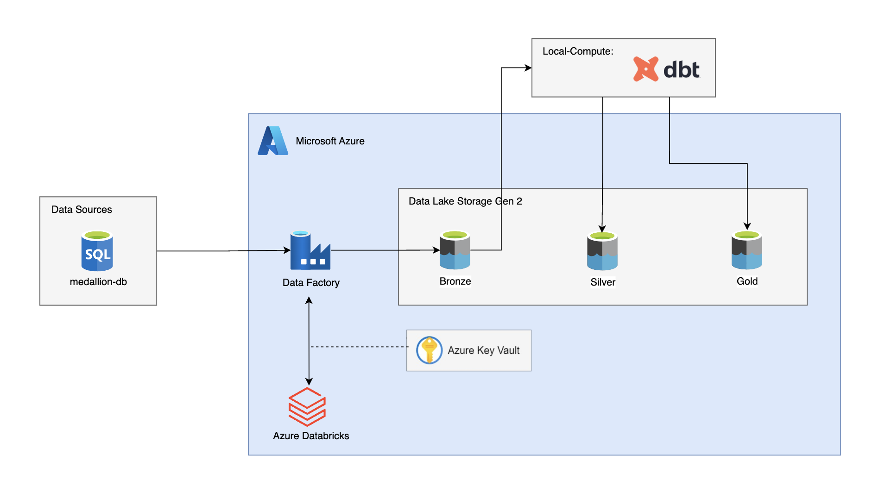
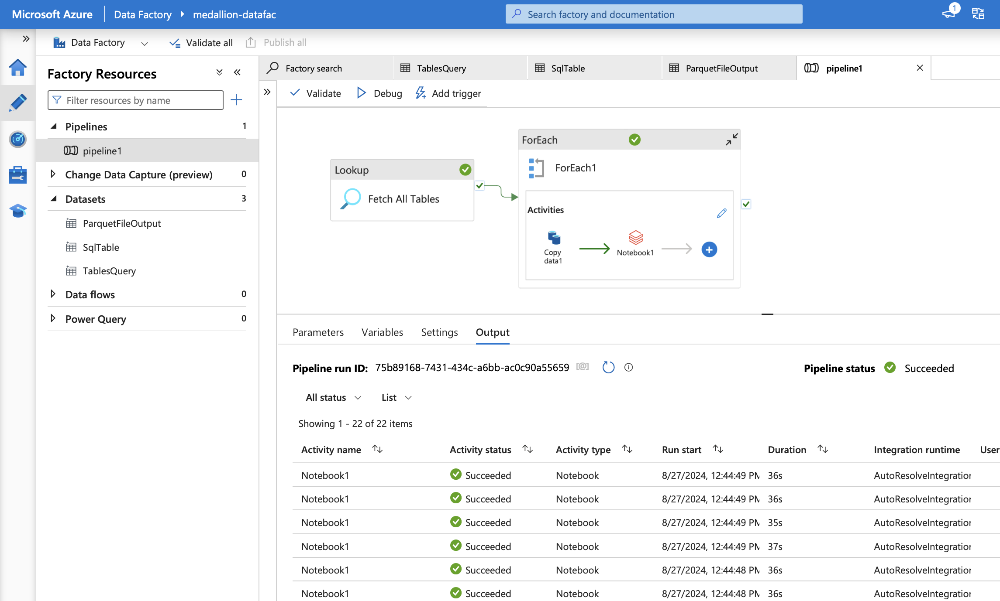

# Medallion Data Lakehouse Project

This project involves setting up a complete data pipeline using Microsoft Azure services, including Azure Data Factory (ADF), Azure Data Lake Storage Gen 2 (ADLS Gen 2), Azure Databricks, and dbt (Data Build Tool). The pipeline processes data from an SQL database, transforms it, and stores it in different layers (Bronze, Silver, and Gold) in a Delta Lake format.

Project architecture:


## Table of Contents

- [Project Overview](#project-overview)
- [Technologies Used](#technologies-used)
- [Setup and Installation](#setup-and-installation)
- [Usage](#usage)
- [Instructions](#instructions)
- [Project Structure](#project-structure)
- [Features](#features)
- [Contributing](#contributing)
- [License](#license)

## Project Overview

The Medallion Project demonstrates the implementation of a data pipeline that ingests data from an SQL database (medallion-db) and processes it into three layers: Bronze, Silver, and Gold. The pipeline uses Azure Data Factory to dynamically extract table names from the source database and bulk copy the data into the Bronze layer using Azure Databricks to create Delta tables. The data is then transformed and loaded into the Silver and Gold layers using dbt.

## Technologies Used

- **Azure Data Factory**: Orchestrates the data pipeline and handles dynamic data extraction and loading.
- **Azure Data Lake Storage Gen 2**: Stores data in the Bronze, Silver, and Gold layers.
- **Azure Databricks**: Performs the initial data transformation and stores the data as Delta tables.
- **dbt (Data Build Tool)**: Transforms and loads data into the Silver and Gold layers.
- **Azure Key Vault**: Secures sensitive information, such as connection strings and credentials.
- **SQL Database (medallion-db)**: Source of the data.

## Setup and Installation

### Prerequisites

Ensure you have the following installed:

- Azure account with necessary services (Key Vault, Storage Account, Data Factory, Databricks)
- Local environment with dbt installed
- Azure CLI for resource management
- Docker (optional, if using containers)

### Steps

1. **Clone the repository**
    ```bash
    git clone https://github.com/yourusername/medallion_project.git
    cd medallion_project
    ```

2. **Configure Azure Services**
   - Set up the Azure resources (Storage Account, Data Factory, Key Vault, Databricks) using the provided ARM templates or manually through the Azure Portal.

3. **Configure ADF Pipeline**
   - Use the lookup function in ADF to fetch table names from the medallion-db.
   - Implement a `ForEach` loop in ADF to dynamically process each table and copy data to the Bronze layer in ADLS Gen 2.
   - Pipeline:
   

4. **Set up Databricks**
   - Create a Databricks cluster and configure it to work with the ADLS Gen 2 storage.
   - Write and execute notebooks to process the data and create Delta tables in the Bronze layer.
   - You can use the notebook located at `azure_references/databricks/base_notebook.ipynb` to accomplish this task.

5. **Install dbt**
   - Install dbt in your local environment:
     ```bash
     pip install dbt
     ```
   - Set up the dbt project to transform and load data into the Silver and Gold layers by copying the code from the `models` and `snapshots` directories in the cloned repository.

6. **Run the Pipeline**
   - Trigger the ADF pipeline to start the data ingestion process.
   - Use dbt to transform and load data into the Silver and Gold layers by running the following commands:
     ```bash
     dbt debug
     dbt run
     ```

## Usage

1. **ADF Pipeline Execution**:
   - Access Azure Data Factory and trigger the pipeline to start the data ingestion process from medallion-db to the Bronze layer.

2. **Data Transformation with dbt**:
   - In your local environment, use dbt to run the transformation models and load data into the Silver and Gold layers.

3. **Monitoring and Logging**:
   - Monitor the execution of the pipeline in Azure Data Factory and check logs in Azure Databricks for any issues.

## Instructions

1. **Extract Data**:
   - ADF dynamically retrieves table names from medallion-db using the lookup function.
   - Data is bulk copied into the Bronze layer using Databricks, creating Delta tables.

2. **Transform and Load Data**:
   - dbt transforms the data in the Bronze layer and loads it into the Silver layer.
   - Further transformations are applied using dbt models, and the data is loaded into the Gold layer.

3. **Run dbt Models**:
   - Execute the dbt models in your local environment to perform the necessary transformations.

## Project Structure

### Project Structure

The project is organized as follows:

- `README.md`: Project overview and instructions
- `azure_references`: Azure-specific references and resources
  - `adf_workflow.png`: Diagram of ADF workflow
  - `databricks`
    - `base_notebook.ipynb`: Base notebook for Databricks processing
    - `catalog.png`: Catalog image reference
- `logs`: Log files
- `medallion_dbt`: dbt project directory
  - `README.md`: Overview of the dbt project
  - `analyses`: Folder for analysis files (currently empty)
  - `dbt_project.yml`: dbt project configuration
  - `logs`
    - `dbt.log`: Additional dbt log file
  - `macros`: Custom dbt macros (currently empty)
  - `models`: dbt models for data transformations
    - `marts`: Data marts for specific subject areas
      - `customer`: Customer-related models
        - `dim_customer.sql`: SQL script for customer dimension table
        - `dim_customer.yml`: Metadata for customer dimension table
      - `product`: Product-related models
        - `dim_product.sql`: SQL script for product dimension table
        - `dim_product.yml`: Metadata for product dimension table
      - `sales`: Sales-related models
        - `sales.sql`: SQL script for sales fact table
        - `sales.yml`: Metadata for sales fact table
    - `staging`: Staging area for raw data
      - `bronze.yml`: Metadata for Bronze staging layer
  - `seeds`: Seed data (currently empty)
  - `snapshots`: dbt snapshots for historical data tracking
    - `address.sql`: SQL script for address snapshot
    - `customer.sql`: SQL script for customer snapshot
    - `customeraddress.sql`: SQL script for customer address snapshot
    - `product.sql`: SQL script for product snapshot
    - `productmodel.sql`: SQL script for product model snapshot
    - `salesorderdetail.sql`: SQL script for sales order detail snapshot
    - `salesorderheader.sql`: SQL script for sales order header snapshot
  - `target`: Directory for compiled and run artifacts
  - `tests`: Directory for dbt tests (currently empty)
- `project_architecture.png`: Image of the project architecture

## Features

- **Dynamic Data Extraction**: Automatically extracts table names and processes data in bulk.
- **Layered Data Architecture**: Organizes data into Bronze, Silver, and Gold layers for better data management.
- **Delta Lake**: Uses Delta tables for efficient data storage and retrieval.
- **dbt Integration**: Leverages dbt for robust data transformation and version control.

## Contributing

Contributions are welcome! To contribute:

1. Fork the repository.
2. Create a new branch (`git checkout -b feature-branch`).
3. Make your changes and commit them (`git commit -m 'Add new feature'`).
4. Push to the branch (`git push origin feature-branch`).
5. Open a pull request.

Please ensure your code follows the project's coding standards and includes relevant tests.

## License

This project is licensed under the MIT License. See the [LICENSE](LICENSE) file for details.